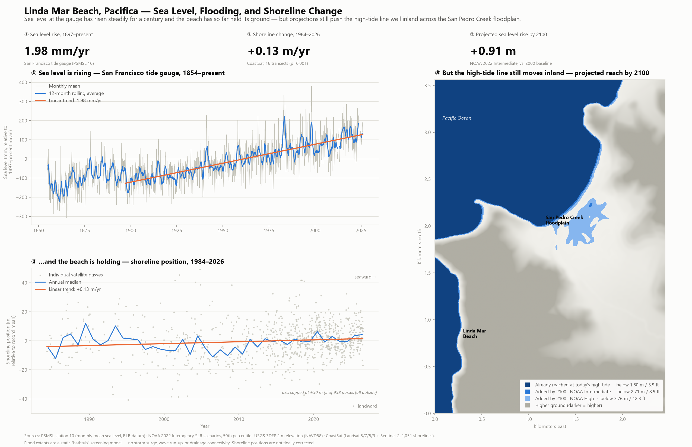
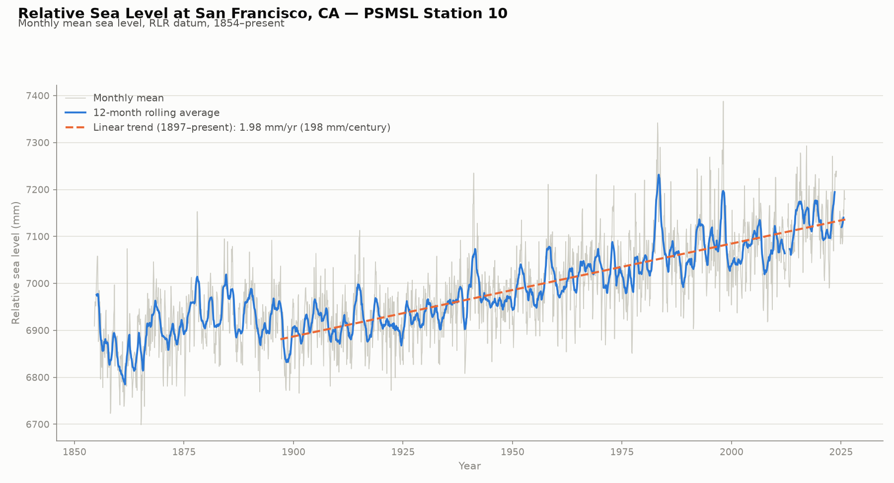
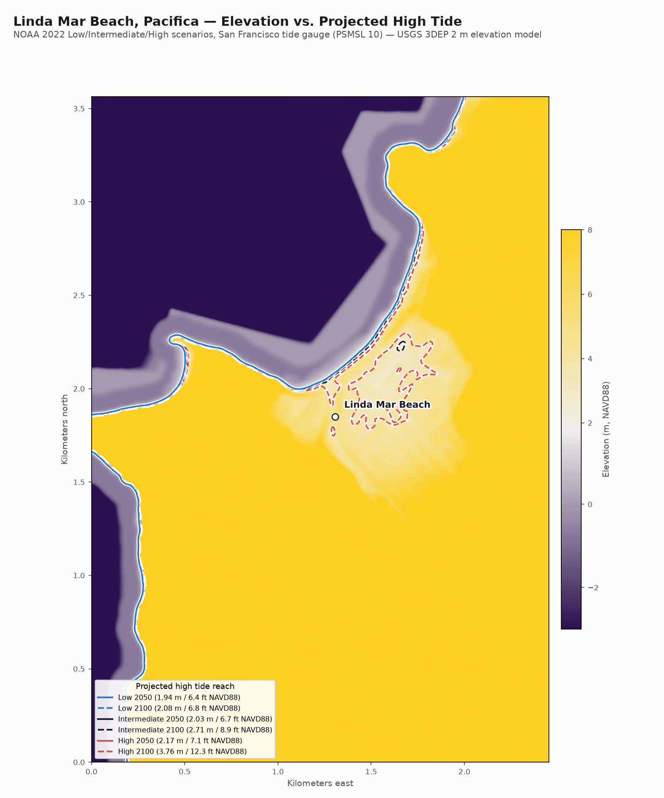
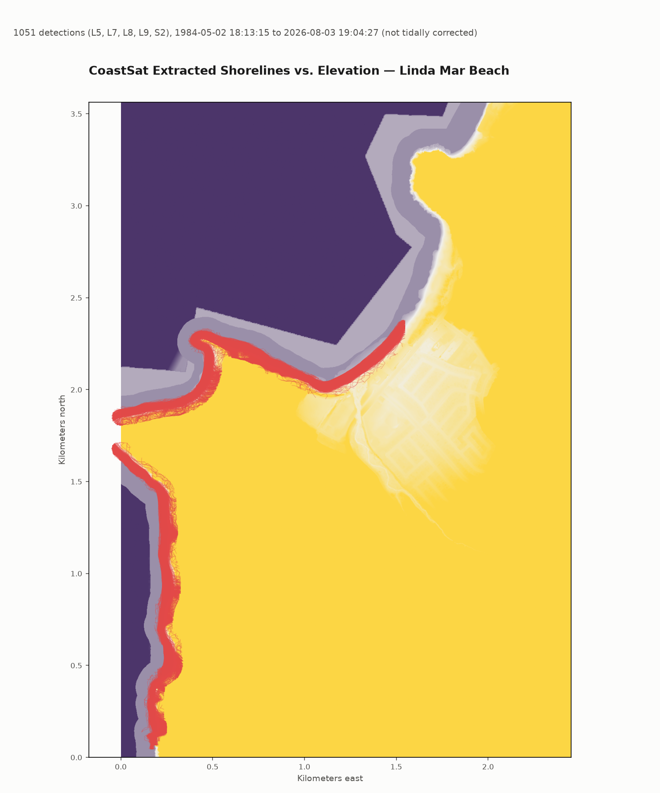
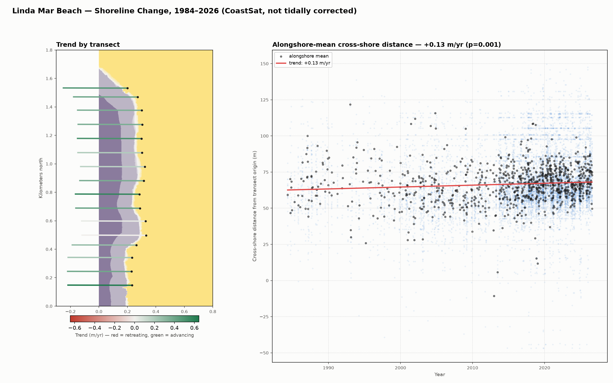

# Linda Mar Sea Level

Mapping sea level change and its impact on Linda Mar Beach, Pacifica, CA,
using the San Francisco tide gauge (PSMSL station 10) as the historical
reference record.



All three phases in one figure (`scripts/plot_summary.py`). The individual
phase deliverables:






## Setup

```powershell
py -m venv .venv
.\.venv\Scripts\python.exe -m pip install -r requirements.txt
```

## Usage

```powershell
cd scripts
..\.venv\Scripts\python.exe plot_sea_level.py          # Phase 1 chart
..\.venv\Scripts\python.exe download_dem.py             # Phase 2: fetch DEM
..\.venv\Scripts\python.exe extract_slr_scenarios.py    # Phase 2: SLR scenario table
..\.venv\Scripts\python.exe plot_elevation_map.py        # Phase 2: elevation map
..\.venv\Scripts\python.exe plot_transect_trend.py       # Phase 3: shoreline trend
..\.venv\Scripts\python.exe plot_summary.py              # All three phases, one figure
```

The Phase 3 steps that produce `data/coastsat_*` (`scripts/coastsat/`) need the
separate `coastsat` conda environment instead — see `CLAUDE.md`.

`plot_sea_level.py` downloads the PSMSL data (if not already in `data/`),
computes a 12-month rolling average, fits a linear trend from 1897 onward,
and saves `output/sf_sea_level_trend.png`.

`plot_elevation_map.py` colors a USGS 3DEP elevation model of Linda Mar
Beach and marks how far inland NOAA's 2022 "Intermediate" scenario projects
high tide to reach by 2050 and 2100.

## Status

- **Phase 1 (done):** historical sea level trend from the SF tide gauge —
  measured at ~1.98 mm/yr, matching NOAA's published figure.
- **Phase 2 (done):** elevation map of Linda Mar Beach vs. NOAA 2022
  Low/Intermediate/High sea-level-rise scenarios for 2050 and 2100.
- **Phase 4 (done):** interactive three.js site — a rotatable 3D model of the
  present-day terrain with a sea-level slider (today's high tide → 2100) and a
  1984–2026 shoreline animation, plus the Phase 1 chart and headline numbers as
  panels. Lives in `site/`; see below.
- **Phase 3 (done):** shoreline change at Linda Mar Beach using
  [CoastSat](https://github.com/kvos/CoastSat) (satellite-derived
  shoreline positions via Google Earth Engine). Needs a separate conda
  environment (`coastsat`, Python 3.11) — see `CLAUDE.md` for setup.
  1,051 shorelines extracted from 1984–2026 (Landsat 5/7/8/9 + Sentinel-2),
  measured along 16 shore-normal transects: alongshore-mean trend
  **+0.131 m/yr (p=0.001)** — the beach has been slightly advancing, not
  retreating (not tidally corrected; see `CLAUDE.md` for caveats).

## Phase 4 — interactive site

A rotatable 3D terrain model with a sea-level slider and a 1984–2026 shoreline
animation. Terrain is present-day only and never changes; only the water level
and the shoreline positions do.

```powershell
.\.venv\Scripts\python.exe scripts\build_site.py    # regenerate site/data + vendor three.js
.\.venv\Scripts\python.exe scripts\bundle_site.py   # optional: single-file bundles in dist/
```

`site/` is committed and fully static — serve it with any web server, or push it
to GitHub Pages as-is:

```powershell
.\.venv\Scripts\python.exe -m http.server 8000 --directory site
```

`bundle_site.py` additionally produces `dist/linda-mar-explorer.html`, a single
self-contained ~4 MB file (three.js and all data inlined, no network access) you
can double-click or hand to someone directly. `dist/` is gitignored — it is
regenerated from `site/`.

See `CLAUDE.md` for full project details.
